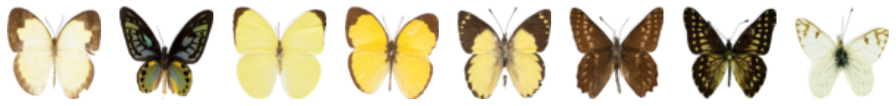
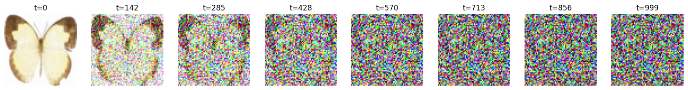
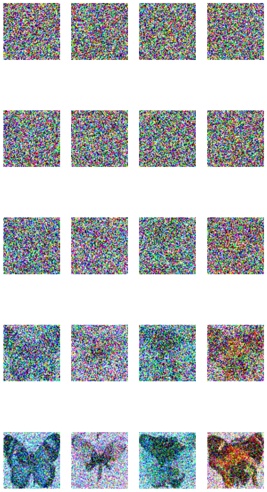
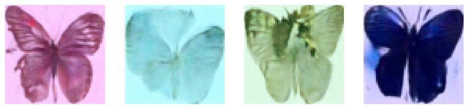

# 🦋 Butterfly Image Generation with DDPM

A from-scratch implementation of **Denoising Diffusion Probabilistic Models (DDPM)** trained on the [Smithsonian Butterflies dataset](https://huggingface.co/datasets/huggan/smithsonian_butterflies_subset) using HuggingFace Diffusers and PyTorch.

> 📖 This project follows concepts from *Using Stable Diffusion with Python* by Andrew Zhu — implemented and experimented with independently on Google Colab.

---

## 🖼️ Results

### 📦 Dataset — Smithsonian Butterflies
Real butterfly images used for training:



---

### 🔊 Forward Diffusion — Adding Noise
A clean butterfly image progressively destroyed by Gaussian noise over 1000 timesteps:



> At `t=0` the original image is clear. By `t=999` it is indistinguishable from pure noise. The model learns to reverse this process.

---

### 🔁 Reverse Diffusion — Refinement Process
Starting from pure Gaussian noise, the UNet iteratively denoises toward butterfly-shaped images:



> Each row shows a denoising step. By the final rows, recognizable butterfly structures begin to emerge — wings, body, and symmetry.

---

### ✅ Generated Images (after 50 epochs)
Final butterfly images generated by the trained model:



> Images are 64×64. The model successfully captures wing structure, symmetry, and colour variation across samples.

---

## 📁 Project Structure

```
butterfly-ddpm/
│
├── Diffusion_model.ipynb   # Main training & inference notebook
├── results/
│   ├── buterflydataset.png
│   ├── adding_noise.png
│   ├── Refinement_Process_.png
│   └── generated_images.png
└── README.md
```

---

## 🚀 Getting Started

### Prerequisites

- Python 3.8+
- Google Colab (recommended) or local GPU with CUDA

### Installation

```bash
pip install diffusers transformers accelerate torch datasets torchvision matplotlib
pip install triton
```

### Run the Notebook

Open `Diffusion_model.ipynb` in Google Colab and run all cells top to bottom.

> ⚠️ A **GPU runtime** is required. In Colab: `Runtime → Change runtime type → T4 GPU`

---

## 🧠 Model Architecture

| Component | Details |
|---|---|
| Model | UNet2D with Attention |
| Input size | 64 × 64 × 3 |
| Block channels | 64 → 128 → 256 → 512 |
| Down blocks | `DownBlock2D`, `DownBlock2D`, `AttnDownBlock2D`, `AttnDownBlock2D` |
| Up blocks | `AttnUpBlock2D`, `AttnUpBlock2D`, `UpBlock2D`, `UpBlock2D` |
| Scheduler | DDPMScheduler (1000 timesteps) |
| Beta range | 0.001 → 0.02 (linear) |

---

## 🏋️ Training

| Parameter | Value |
|---|---|
| Dataset | `huggan/smithsonian_butterflies_subset` |
| Image size | 64 × 64 |
| Batch size | 8 |
| Epochs | 50 |
| Optimizer | AdamW |
| Learning rate | 1e-4 |
| Loss function | MSE (predicted noise vs actual noise) |

---

## 🔬 Inference

Two inference methods are implemented:

**1. DDPMPipeline (simple)**
```python
pipeline = DDPMPipeline(unet=model, scheduler=noise_scheduler)
images = pipeline(batch_size=4, num_inference_steps=50).images
```

**2. Manual Reverse Diffusion Loop**
Denoises step by step and saves intermediate outputs every 10 steps — great for visualizing the refinement process.

---

## 💡 What I Learned

- How the **forward diffusion process** adds noise mathematically: `q(x_t | x_0)`
- How a **UNet predicts noise** at each timestep rather than predicting the image directly
- The role of **attention blocks** in capturing global structure
- How **reverse diffusion** iteratively denoises from `x_T → x_0`
- Hands-on use of HuggingFace `diffusers` library

---

## 🔭 Future Experiments

- [ ] Try cosine beta schedule instead of linear
- [ ] Train for 100–200 epochs for sharper results
- [ ] Increase image size to 128×128
- [ ] Add conditional generation (by butterfly species)
- [ ] Compute FID score to measure generation quality

---

## 📚 References

- [HuggingFace Diffusers](https://huggingface.co/docs/diffusers)
- [DDPM Paper — Ho et al. 2020](https://arxiv.org/abs/2006.11239)
- [Smithsonian Butterflies Dataset](https://huggingface.co/datasets/huggan/smithsonian_butterflies_subset)
- *Using Stable Diffusion with Python* — Andrew Zhu

---

## 👤 Author

Learning ML one experiment at a time 🚀  
Feel free to fork, star ⭐, or open an issue if you have ideas!
